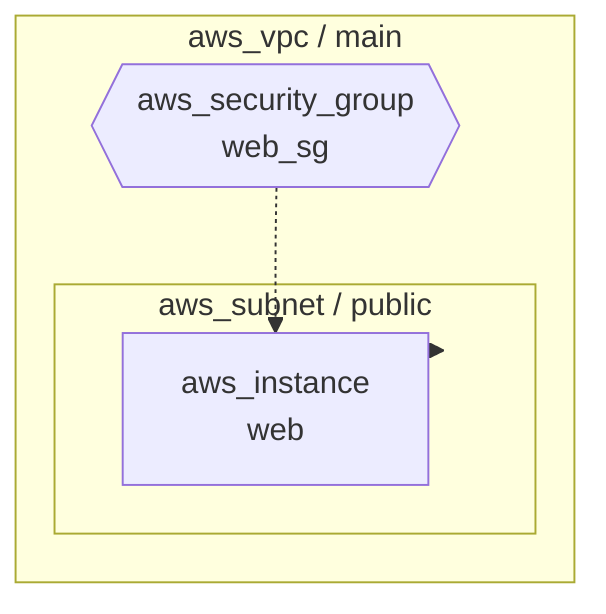

# TerraSketch アーキテクチャ設計書

## 1. 設計思想

### 1.1 基本原則

TerraSketch は以下の原則に基づいて設計されている。

| 原則 | 説明 |
|---|---|
| **Single Source of Truth** | Terraform state JSON を唯一の信頼源とし、クラウドAPIに一切依存しない |
| **ローカル完結** | 外部サービスへの通信なし。オフライン環境でも動作可能 |
| **最小依存** | 外部依存は `networkx` のみ。numpy や graphviz 等は不使用 |
| **拡張容易性** | リソースタイプ・関係ルール・レンダラーの追加が容易な構造 |

### 1.2 なぜ state JSON か

```
Terraform HCL (.tf)  →  terraform apply  →  Terraform State (.tfstate)
     ↑ 宣言的定義                                ↑ 実際のインフラ状態
```

- **HCL** はユーザーの「意図」を表す。変数・モジュール・条件分岐等が含まれ、実際のインフラ構成とは異なる場合がある
- **State JSON** は Terraform が管理する「実際のインフラ状態」であり、全リソースの属性（ID、ARN、CIDR等）が確定値として格納されている
- State JSON を信頼源とすることで、**実際にデプロイされた構成** を正確に可視化できる

> 注: v0.1.0 で HCL パーサーも追加されたが、これは State JSON が利用できない場合の補助手段として位置付けている。

## 2. 全体アーキテクチャ

### 2.1 処理パイプライン

```
┌─────────────────────────────────────────────────────────────────┐
│                         TerraSketch                             │
│                                                                 │
│  ┌──────────┐   ┌──────────┐   ┌──────────┐   ┌─────────────┐ │
│  │  Parser   │──▶│  Graph   │──▶│  Layout  │──▶│  Renderer   │ │
│  │          │   │  Builder  │   │  Engine  │   │             │ │
│  └──────────┘   └──────────┘   └──────────┘   └─────────────┘ │
│       ▲              │                              │          │
│       │              ▼                              ▼          │
│  state.json    ┌──────────┐                  .drawio / .md /   │
│  / .tf         │ Security │                  .puml             │
│                │ Annotator│                                    │
│                └──────────┘                                    │
└─────────────────────────────────────────────────────────────────┘
```

### 2.2 コンポーネント間のデータフロー

```
入力ファイル
    │
    ▼
Parser ─────────────▶ list[Resource]
                          │
                          ▼
Graph Builder ──────▶ nx.DiGraph
                      (nodes: Resource, edges: relation_type)
                          │
        ┌─────────────────┤
        ▼                 ▼
Security Annotator   Layout Engine ──▶ dict[str, (x, y)]
(SGルール注釈)              │
        │                   │
        ▼                   ▼
    nx.DiGraph          positions
        │                   │
        └──────┬────────────┘
               ▼
          Renderer ──────────▶ 出力ファイル (.drawio / .md / .puml)
```

## 3. コンポーネント詳細

### 3.1 Parser（`parser/`）

#### State Parser（`state_parser.py`）

Terraform の `terraform show -json` 出力を解析する。

```python
@dataclass
class Resource:
    id: str                        # リソースID（例: "vpc-12345"）
    type: str                      # リソースタイプ（例: "aws_vpc"）
    name: str                      # Terraform内での名前（例: "main"）
    provider: str                  # プロバイダ名
    attributes: dict[str, Any]     # 全属性値

    @property
    def address(self) -> str:      # "aws_vpc.main" 形式のアドレス
        return f"{self.type}.{self.name}"
```

**解析対象の JSON 構造:**

```json
{
  "values": {
    "root_module": {
      "resources": [...],
      "child_modules": [
        {
          "resources": [...],
          "child_modules": [...]
        }
      ]
    }
  }
}
```

子モジュールは再帰的に辿り、全てのリソースをフラットなリストとして返す。

#### HCL Parser（`hcl_parser.py`）

外部依存なしの軽量パーサー。正規表現で `resource` ブロックを抽出する。

- コメント除去（`#`、`//`、`/* */`）
- ブラケットの深さカウントによるブロック境界検出
- 文字列・数値・ブール・リスト・tags の属性抽出
- **制限**: 変数展開（`var.xxx`）、条件式、for式は未対応

### 3.2 Graph Builder（`graph/builder.py`）

#### 関係ルールシステム

リソース間の依存関係は **ルールベース** で定義される:

```python
# (ソースタイプ, 属性名, ターゲットタイプ) のタプル
("aws_subnet", "vpc_id", "aws_vpc")
# → aws_subnet リソースの vpc_id 属性値が aws_vpc リソースのIDと一致すれば
#   VPC → Subnet のエッジを生成
```

**エッジ解決の流れ:**

```
1. ソースリソースの属性値を取得（ネスト属性にも対応）
2. 属性値をIDとして参照先を検索
3. IDで見つからなければ名前でフォールバック検索
4. 一致するターゲットにエッジを追加（関係タイプ付き）
```

#### ネスト属性パス解決

`_get_nested()` 関数でドット区切りパスを辿る:

```python
# 例: "vpc_config.subnet_ids"
attrs = {"vpc_config": {"subnet_ids": ["subnet-1"]}}
_get_nested(attrs, "vpc_config.subnet_ids")  # → ["subnet-1"]
```

#### 関係タイプ

| タイプ | 意味 | 例 | 視覚表現 |
|---|---|---|---|
| `contains` | 親が子を包含 | VPC → Subnet | 実線（緑） |
| `references` | 参照関係 | EC2 → SG | 破線（青） |

### 3.3 Layout Engine（`layout/engine.py`）

3つのレイアウトアルゴリズムを状況に応じて使い分ける:

```
                      グラフ入力
                         │
                    ┌────▼────┐
                    │ノード数=0│──▶ 空の辞書を返す
                    └────┬────┘
                         │ No
                    ┌────▼────┐
                    │ノード数=1│──▶ 固定座標 (100, 100)
                    └────┬────┘
                         │ No
                    ┌────▼────────┐
                    │切断グラフ？  │──▶ _layout_disconnected()
                    │(2+コンポーネント)│   各コンポーネントを独立レイアウト
                    └────┬────────┘   + 水平オフセット配置
                         │ No
                    ┌────▼────┐
                    │  DAG？   │──▶ _hierarchical_layout()
                    └────┬────┘   トポロジカルソート + 最長パス層分け
                         │ No
                         ▼
                    _grid_layout()
                    √n 列のグリッド配置
```

#### 階層レイアウトの詳細

1. トポロジカルソートで全ノードを走査
2. 各ノードの「最長パス長」を層番号とする（ルート=0、子=親の層+1）
3. 同じ層のノードを水平に等間隔配置
4. 負の座標を正規化

#### 切断グラフ分離の詳細

1. `nx.weakly_connected_components()` で連結成分を分割
2. ノード数の多い順にソート（メインコンポーネントを左に配置）
3. 各コンポーネントを独立してレイアウト（DAGなら階層、巡回ならグリッド）
4. 水平方向にオフセットを加えて並べる（gap=150px）

### 3.4 Renderer（`renderer/`）

#### draw.io Renderer

draw.io 互換の XML（mxfile 形式）を生成する。

**XML構造:**

```xml
<mxfile>
  <diagram>
    <mxGraphModel>
      <root>
        <mxCell id="0"/>                          <!-- ルート -->
        <mxCell id="1" parent="0"/>               <!-- デフォルト親 -->
        <mxCell id="2" ... container="1"/>        <!-- VPC コンテナ -->
        <mxCell id="3" ... parent="2"/>           <!-- Subnet ノード -->
        <mxCell id="4" ... edge="1"/>             <!-- エッジ -->
      </root>
    </mxGraphModel>
  </diagram>
</mxfile>
```

**VPC コンテナグルーピング:**

1. VPC/VNet タイプのノードを検出
2. `nx.descendants()` で全子孫ノードを収集
3. 子ノードの座標からバウンディングボックスを計算
4. コンテナセル（`container=1`）として VPC を描画
5. 子ノードの座標をコンテナの相対座標に変換

**ツールチップ:**

各ノードに `tooltip` 属性を付与。ARN、CIDR、instance_type、tags 等の重要属性をホバー時に表示する。

#### Mermaid Renderer

GitHub/GitLab 等で直接表示可能な Mermaid flowchart 構文を生成する。

**VPC/Subnet ネスト:**



- 包含関係: `-->` 実線矢印
- 参照関係: `-.->` 破線矢印

#### PlantUML Renderer

PlantUML コンポーネント図を生成する。

- VPC/Subnet を `package` で階層化
- リソースにステレオタイプ（`<<EC2>>`、`<<RDS>>` 等）を付与
- リソースタイプに応じた背景色

### 3.5 Mapping（`mapping/`）

#### DrawioStyle

```python
@dataclass
class DrawioStyle:
    shape: str      # draw.io 図形名
    width: int      # ピクセル幅
    height: int     # ピクセル高
    style: str      # draw.io style 属性文字列
```

#### マッピング構成

```
resource_map.py          extended_resources.py
├── 8 AWS 基本            ├── 20+ AWS 拡張
├── 6 Azure 基本          ├── 7 Azure 拡張
└── デフォルトスタイル     ├── 15 AWS 関係ルール
                          └── 6 Azure 関係ルール
```

`get_drawio_style()` は遅延読み込みで拡張マッピングを初回アクセス時に統合する。

## 4. エラーハンドリング方針

| レイヤー | エラー種別 | 対処 |
|---|---|---|
| Parser | ファイルなし | `FileNotFoundError` を送出 |
| Parser | JSON不正 | `ValueError` を送出 |
| Graph Builder | 属性未解決 | サイレントにスキップ（エッジ未生成） |
| Layout | 空グラフ | 空の辞書を返す |
| Renderer | 出力先なし | `mkdir(parents=True)` で自動作成 |
| CLI | 引数不足 | argparse が自動エラー表示 |
| GUI | 全般 | ログエリアにエラー表示、ボタン再有効化 |

## 5. テスト戦略

```
tests/
├── test_parser.py        # 6件: 正常系・異常系・子モジュール再帰
├── test_hcl_parser.py    # 12件: HCL解析・属性抽出・コメント除去
├── test_graph.py         # 11件: グラフ構築・ネスト属性・セキュリティ
├── test_layout.py        # 9件: 階層・グリッド・切断グラフ・大規模
├── test_renderer.py      # 14件: draw.io/Mermaid/PlantUML・エッジ・ツールチップ
├── test_mapping.py       # 10件: AWS/Azure/拡張マッピング
└── test_integration.py   # 4件: サンプルstateからの全パイプライン
```

**テスト方針:**
- 各コンポーネントのユニットテスト + サンプルデータでの統合テスト
- `samples/sample_state.json` を共有テストデータとして使用
- `tmp_path` フィクスチャでファイル出力テストを隔離
