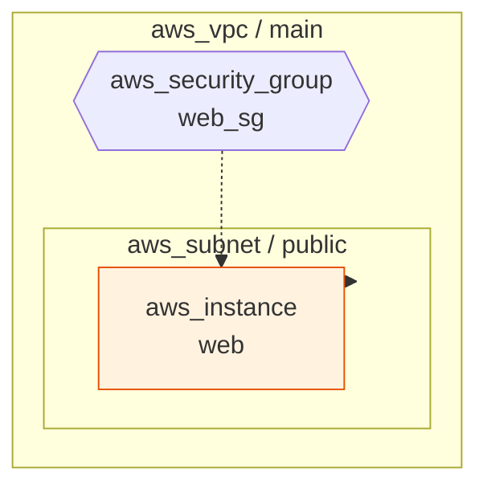
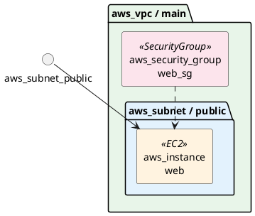

# TerraSketch データフロー詳細

本ドキュメントでは、入力から出力までの各段階でデータがどのように変換されるかを詳細に解説する。

## 1. 入力データ

### 1.1 Terraform State JSON

`terraform show -json` コマンドで出力される JSON ファイル。

```json
{
  "format_version": "1.0",
  "terraform_version": "1.5.0",
  "values": {
    "root_module": {
      "resources": [
        {
          "address": "aws_vpc.main",
          "mode": "managed",
          "type": "aws_vpc",
          "name": "main",
          "provider_name": "registry.terraform.io/hashicorp/aws",
          "values": {
            "id": "vpc-0123456789abcdef0",
            "cidr_block": "10.0.0.0/16",
            "tags": {"Name": "main-vpc"}
          }
        }
      ],
      "child_modules": []
    }
  }
}
```

### 1.2 Terraform HCL ファイル

```hcl
resource "aws_vpc" "main" {
  cidr_block = "10.0.0.0/16"
  tags = {
    Name = "main-vpc"
  }
}
```

## 2. Parser 出力 → `list[Resource]`

Parser は入力ファイルを解析し、`Resource` データクラスのリストを生成する。

```python
[
    Resource(
        id="vpc-0123456789abcdef0",
        type="aws_vpc",
        name="main",
        provider="registry.terraform.io/hashicorp/aws",
        attributes={
            "id": "vpc-0123456789abcdef0",
            "cidr_block": "10.0.0.0/16",
            "tags": {"Name": "main-vpc"}
        },
    ),
    Resource(
        id="subnet-0123456789abcdef0",
        type="aws_subnet",
        name="public",
        provider="...",
        attributes={
            "id": "subnet-0123456789abcdef0",
            "vpc_id": "vpc-0123456789abcdef0",    # ← この属性が関係を決定
            "cidr_block": "10.0.1.0/24",
        },
    ),
]
```

## 3. Graph Builder 出力 → `nx.DiGraph`

### 3.1 ノード構造

各ノードのアドレス（`"aws_vpc.main"` 形式）をキーとし、以下の属性を持つ:

| 属性 | 型 | 説明 |
|---|---|---|
| `resource` | `Resource` | 元の Resource オブジェクト |
| `type` | `str` | リソースタイプ |
| `label` | `str` | 表示ラベル（`"aws_vpc\nmain"` 形式） |

### 3.2 エッジ構造

エッジは **親 → 子** の方向（VPC → Subnet → EC2）で張られる。

| 属性 | 型 | 説明 |
|---|---|---|
| `relation_type` | `str` | `"contains"` または `"references"` |

### 3.3 関係解決の具体例

```
ルール: ("aws_subnet", "vpc_id", "aws_vpc")

1. aws_subnet.public の attributes から "vpc_id" を取得
   → "vpc-0123456789abcdef0"

2. IDインデックスで検索: id_index["vpc-0123456789abcdef0"]
   → aws_vpc.main が見つかる

3. ターゲットタイプ確認: aws_vpc.main.type == "aws_vpc" ✓

4. エッジ追加: aws_vpc.main → aws_subnet.public
   (relation_type="contains"  ← _CONTAINMENT_RULES に含まれるため)
```

### 3.4 ネスト属性解決の具体例

```
ルール: ("aws_lambda_function", "vpc_config.subnet_ids", "aws_subnet")

1. aws_lambda_function.handler の attributes から
   "vpc_config.subnet_ids" をドット区切りで辿る:
   attrs["vpc_config"]["subnet_ids"] → ["subnet-1", "subnet-2"]

2. リスト内の各IDについてIDインデックスを検索

3. 一致するエッジを追加:
   aws_subnet.pub1 → aws_lambda_function.handler
   aws_subnet.pub2 → aws_lambda_function.handler
```

## 4. Layout Engine 出力 → `dict[str, tuple[float, float]]`

各ノードのピクセル座標を計算する。

```python
{
    "aws_vpc.main":          (350.0, 100.0),   # 最上位層
    "aws_subnet.public":     (200.0, 300.0),   # 第2層（左）
    "aws_subnet.private":    (500.0, 300.0),   # 第2層（右）
    "aws_instance.web":      (200.0, 500.0),   # 第3層
    "aws_security_group.sg": (500.0, 500.0),   # 第3層
}
```

### 4.1 切断グラフの場合

```
コンポーネント1（3ノード）: x_offset = 100
  → 階層レイアウト → 座標に x_offset を加算

コンポーネント2（2ノード）: x_offset = 100 + comp1_width + gap + scale_x
  → 階層レイアウト → 座標に x_offset を加算
```

## 5. Renderer 出力

### 5.1 draw.io XML

```xml
<?xml version='1.0' encoding='utf-8'?>
<mxfile host="terrasketch" type="device">
  <diagram id="terrasketch-diagram" name="TerraSketch">
    <mxGraphModel dx="1422" dy="762" ...>
      <root>
        <mxCell id="0"/>
        <mxCell id="1" parent="0"/>

        <!-- VPC コンテナ -->
        <mxCell id="2"
                value="aws_vpc / main"
                style="rounded=1;...container=1;collapsible=0;"
                vertex="1" parent="1">
          <mxGeometry x="60" y="40" width="680" height="560" as="geometry"/>
        </mxCell>

        <!-- Subnet ノード（VPC の子） -->
        <mxCell id="3"
                value="aws_subnet&#xa;public"
                style="outlineConnect=0;...resIcon=mxgraph.aws4.vpc;"
                vertex="1" parent="2"
                tooltip="Type: aws_subnet&#xa;Name: public&#xa;cidr_block: 10.0.1.0/24">
          <mxGeometry x="140" y="260" width="60" height="60" as="geometry"/>
        </mxCell>

        <!-- 包含エッジ（緑実線） -->
        <mxCell id="4"
                style="...strokeColor=#2e7d32;strokeWidth=2;"
                edge="1" parent="1" source="2" target="3">
          <mxGeometry relative="1" as="geometry"/>
        </mxCell>

        <!-- 参照エッジ（青破線） -->
        <mxCell id="5"
                style="...strokeColor=#1565c0;strokeWidth=1;dashed=1;..."
                edge="1" parent="1" source="3" target="6">
          <mxGeometry relative="1" as="geometry"/>
        </mxCell>
      </root>
    </mxGraphModel>
  </diagram>
</mxfile>
```

### 5.2 Mermaid

```markdown

```

### 5.3 PlantUML


