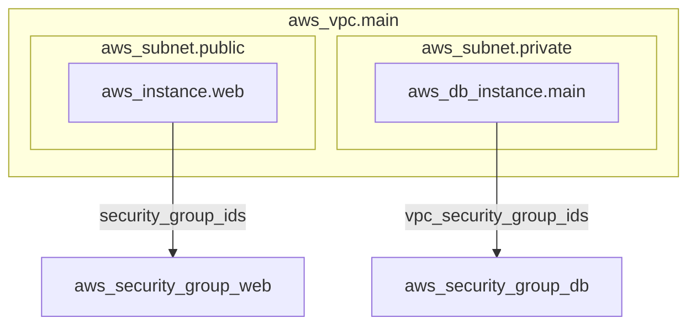

# Atlantis 連携

Atlantis のカスタムワークフローに TerraSketch を統合し、`terraform plan` 実行後に構成図を自動生成して PR コメントに追加します。

## 前提条件

- Atlantis サーバーが稼働していること
- Atlantis サーバー上に Python 3.10+ がインストールされていること
- TerraSketch がインストールされていること:
  ```bash
  pip install terrasketch
  ```
- Terraform CLI が利用可能であること

## セットアップ手順

### 1. フックスクリプトの配置

`integrations/atlantis/terrasketch_hook.sh` をリポジトリに含めます。実行権限が付与されていることを確認してください:

```bash
chmod +x integrations/atlantis/terrasketch_hook.sh
```

### 2. atlantis.yaml の設定

リポジトリのルートに `atlantis.yaml` を作成します。`atlantis.yaml.example` を参考にしてください:

```bash
cp integrations/atlantis/atlantis.yaml.example atlantis.yaml
```

必要に応じて `dir` や `workspace` を環境に合わせて編集してください。

### 3. 環境変数（オプション）

以下の環境変数でフックの動作をカスタマイズできます:

| 変数名 | デフォルト値 | 説明 |
|--------|-------------|------|
| `TERRASKETCH_FORMAT` | `mermaid` | 出力形式（`mermaid` / `drawio` / `plantuml` / `svg` / `html`） |
| `TERRASKETCH_PROVIDER` | `all` | プロバイダ（`aws` / `azure` / `gcp` / `kubernetes` / `all`） |
| `TERRASKETCH_EXTRA_OPTS` | （空） | 追加オプション（例: `--labels --security`） |

Atlantis サーバーの環境変数として設定するか、`atlantis.yaml` の `env` セクションで指定できます:

```yaml
workflows:
  terrasketch:
    plan:
      steps:
        - init
        - plan
        - env:
            name: TERRASKETCH_PROVIDER
            value: aws
        - run: bash integrations/atlantis/terrasketch_hook.sh
```

## 出力例

PR コメントに以下のような構成図が追加されます（Mermaid 形式の場合）:

---

<details><summary>📐 TerraSketch 構成図（クリックで展開）</summary>



</details>

---

> **注意**: GitHub は Mermaid 記法をネイティブにレンダリングします。GitLab や Bitbucket を使用している場合は、`plantuml` 形式の使用を検討してください。

## トラブルシューティング

### 構成図が生成されない

1. Atlantis サーバー上で `terrasketch` コマンドが利用可能か確認:
   ```bash
   which terrasketch
   terrasketch --version
   ```

2. フックスクリプトに実行権限があるか確認:
   ```bash
   ls -la integrations/atlantis/terrasketch_hook.sh
   ```

3. Atlantis のログを確認してエラーメッセージを探す

### PR コメントに構成図が追加されない

- `COMMENT_FILE` 環境変数は Atlantis が自動的に設定します。カスタムワークフローの `run` ステップ内でのみ利用可能です。
- Atlantis のバージョンが `COMMENT_FILE` をサポートしているか確認してください（v0.19.0 以降）。
