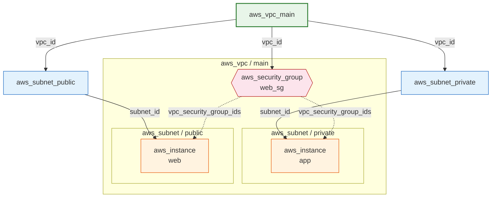

```mermaid
flowchart TD
    subgraph aws_vpc_main_group["aws_vpc / main"]
        subgraph aws_subnet_private_group["aws_subnet / private"]
            aws_instance_app["aws_instance\napp"]
        end
        subgraph aws_subnet_public_group["aws_subnet / public"]
            aws_instance_web["aws_instance\nweb"]
        end
        aws_security_group_web_sg{{"aws_security_group\nweb_sg"}}
    end
    aws_vpc_main -->|"vpc_id"| aws_subnet_public
    aws_vpc_main -->|"vpc_id"| aws_subnet_private
    aws_vpc_main -->|"vpc_id"| aws_security_group_web_sg
    aws_subnet_public -->|"subnet_id"| aws_instance_web
    aws_subnet_private -->|"subnet_id"| aws_instance_app
    aws_security_group_web_sg -.->|"vpc_security_group_ids"| aws_instance_web
    aws_security_group_web_sg -.->|"vpc_security_group_ids"| aws_instance_app

    classDef vpc fill:#e8f5e9,stroke:#2e7d32,stroke-width:2px
    classDef subnet fill:#e3f2fd,stroke:#1565c0,stroke-width:1px
    classDef compute fill:#fff3e0,stroke:#e65100,stroke-width:1px
    classDef security fill:#fce4ec,stroke:#b71c1c,stroke-width:1px
    classDef storage fill:#f3e5f5,stroke:#6a1b9a,stroke-width:1px
    class aws_vpc_main vpc
    class aws_subnet_public subnet
    class aws_subnet_private subnet
    class aws_security_group_web_sg security
    class aws_instance_web compute
    class aws_instance_app compute
```
